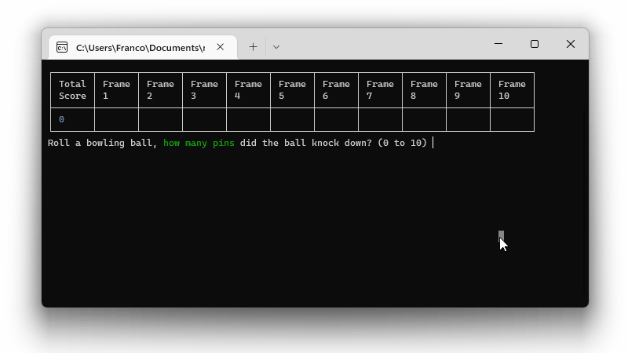
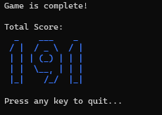

# Bowling Game Kata

This is a solution to the [Bowling Game Kata](https://kata-log.rocks/bowling-game-kata).

Here we have 3 folders:

1. `BowlingGame` folder contains the c# implementation of the solutions
2. `BowlingGame.Tests` folder contains the unit tests
3. `diagrams` folder contains diagrams relating to the solution, such as [UML diagram](diagrams/UML/Bowling%20Game%20Kata.png)

# Instructions

**Prerequisite**: The machine running the application should have [.NET 6.0](https://dotnet.microsoft.com/en-us/download/dotnet/6.0) (or above) installed.

To run the application:

1. clone the repository to your computer
2. then navigate to the `BowlingGame` folder (with `cd` command or otherwise)
3. then run the following command

```c#
dotnet run
```

# Demo



## Key Features

The application will:

1. Prompt the user to input a number, representing the number of pins knocked down by rolling a bowling ball through the lane
2. Update the "score table" to include the user input number, following the "rule of bowling" (see [Bowling Game Kata](https://kata-log.rocks/bowling-game-kata))
3. When all 10 frames were completed with no more bonus rolls, print the "game completion message" with the final score. For example:



# UML Diagram


